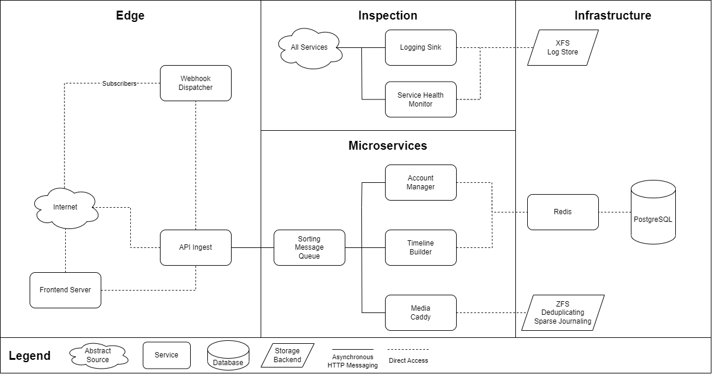

# Gem-Gallery Project

- [Gem-Gallery Project](#gem-gallery-project)
  - [Public Services](#public-services)
    - [API Ingest Server `mgp-api`](#api-ingest-server-mgp-api)
    - [Frontend Server `mgp-frontend`](#frontend-server-mgp-frontend)
    - [Webhook Dispatcher `mgp-notifier`](#webhook-dispatcher-mgp-notifier)
  - [Internal Services](#internal-services)
    - [Media Caddy `mgp-caddy`](#media-caddy-mgp-caddy)
    - [Timeline Builder `mgp-messages`](#timeline-builder-mgp-messages)
    - [Account Manager `mgp-sammy`](#account-manager-mgp-sammy)
    - [Sorting Message Queue `mgp-smq`](#sorting-message-queue-mgp-smq)
  - [Introspection Services](#introspection-services)
    - [Logging Sink](#logging-sink)
    - [Service Health Monitor](#service-health-monitor)

This project utilizes containerized microservices to simplify development and scale.
This README gives a brief overview of the features and milestones associated with each
part of the project - please check the README for each sub-project for more details on each.

## Public Services

### API Ingest Server `mgp-api`

This module is the public-facing interface to the product. It is responsible for
translating HTTP endpoint interactions into messages used by the SMQ, and vice versa.

The primary purpose of this module is to provide an external interface into the product
entirely agnostic of any internal architecture. Changes to the internal communication
or functionality of any microservice should produce no change in the API Server's behavior.

### Frontend Server `mgp-frontend`

The frontend server presents a polished website for users to interact with the service.

### Webhook Dispatcher `mgp-notifier`

The Webhook Dispatcher module is responsible for receiving events from the API Gateway and sending webhooks to authorized subscribers who are interested in reading those events.

## Internal Services

### Media Caddy `mgp-caddy`

The media caddy service is responsible for safely storing and serving media files uploaded
by users. All media formats are normalized to WebP for images and WebM(VP9/Opus) for video.
Filenames are also normalized.

The backing store for the media caddy will be ZFS - with de-duplicating and sparse journaling
to maximize storage performance and space utilization.

To scale storage, the filesystem may be partitioned across a network. To scale throughput,
multiple media caddies may be deployed behind a load balancer.

- [ ] HTTP REST Interface
- [X] Image Transcoding
- [ ] Video Transcoding (Assignee: Monty)
- [X] Name Normalization
- [X] Filesystem I/O

### Timeline Builder `mgp-messages`

The timeline builder is responsible for assembling `Posts` (which may have media, comment threads, etc)
into logical units for return to the API gateway. It may query the account manager to determine if a given
user is able to access a resource.

The Timeline Builder only deals with textual and chronological data - if a post has media associated with it,
it simply returns a URL to that media accessible through the Media Caddy.

- [ ] Paging Support
- [ ] Thread Assembly
- [ ] Individual Post Retrieval

Concepts like "timelines" and "comment threads" are not present in the timeline builder (despite its name);
all it knows about is the unit structure `Post`. Instead, it functions as a hybrid relational/entity-component
system which can create ordered groups of Posts based on static or dynamic post characteristic requirements.

### Account Manager `mgp-sammy`

This module is responsible for managing Authentication and User actions that require Authentication.
It acts as an ingest point for:

- New user sign-ups
- Authentication requests and token generation
- New posts and post edits
- Likes
- Follows
- Blocks
- Reblogs
- Moderation Edits

Internally to the product architecture, the Account Manager can also verify what content a user may
or may not see for the Timeline Builder.

### Sorting Message Queue `mgp-smq`

The SMQ is the primary method of scale and compartmentalization in the product.
No microservice may directly communicate with another and must instead enqueue a message
with this service and wait on its response. It will route incoming messages into different
internal queues based on message type, destination, and current queue statistics.

It will not, however, perform any load balancing duties as that should be handled in a
service-agnostic way such as through NGINX.

## Introspection Services

### Logging Sink

This service is responsible for collecting and storing on-disk the trace data from all the public
and internal services of the product. It performs no transformations on the data except for normalization.

### Service Health Monitor

This service reads "Heartbeats" sent by all the other services and aggregates their current and historical
statuses in a concise manner.