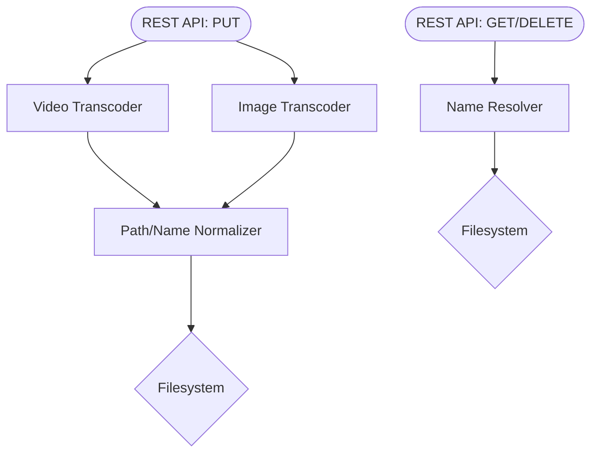

# MGP-Caddy

- [MGP-Caddy](#mgp-caddy)
  - [Roadmap](#roadmap)
  - [Building](#building)
    - [Dependencies](#dependencies)
    - [FFMPEG](#ffmpeg)
  - [Internal Architecture](#internal-architecture)
    - [Code Layout](#code-layout)
  - [API](#api)
    - [`GET /meta/[Normalized Resource ID with extension]`](#get-metanormalized-resource-id-with-extension)
    - [`GET /file/[Normalized Resource ID with extension]`](#get-filenormalized-resource-id-with-extension)
    - [`DELETE /file/[Normalized Resource ID with extension]`](#delete-filenormalized-resource-id-with-extension)
    - [`POST /file [Media File Body]`](#post-file-media-file-body)
    - [Responses](#responses)

## Roadmap

- [ ] Docker Image
- [ ] HTTP REST Interface
- [X] Image Transcoding
- [ ] Video Transcoding (Assignee: Monty)
- [X] Name Normalization
- [X] Filesystem I/O

## Building

`cargo build` will build the binary executable with all its dependencies statically linked.

### Dependencies

This project requires LLVM and FFMPEG to build - see [ffmpeg-next](https://github.com/zmwangx/rust-ffmpeg/wiki/Notes-on-building) for more info.

Our version of FFMPEG is compiled with certain configuration options - you'll need the following static libraries in `dep/lib/{TARGET-TRIPLE}/lib` in order to compile the project.

- libdav1d, for decoding AV1 video [(VideoLan)](https://code.videolan.org/videolan/dav1d)
- MP3LAME, for MP3 [(SourceForge)](https://lame.sourceforge.io/)
- Opus, [opus-codec.org](https://opus-codec.org/)
- LibVPX, for VP9 video [thewebmproject.org](https://www.webmproject.org/) and all its dependencies

Libraries for `x86_64-unknown-linux-gnu` have been precompiled, you shouldn't need to build any C projects to develop on 64 bit linux.

### FFMPEG

The FFMPEG `av*` suite of libraries are automatically build by the ffmpeg crate, which it does through ffmpeg-sys for bindings. Local copies of both crates are
kept in `dep/crate`. They've had a few patches applied to them in order to force them to build with the required additional codecs.

## Internal Architecture



The design of the Media Caddy is strictly a pipeline - incoming data is transcoded, normalized, and stored,
while outgoing data is resolved and returned. 

- **It is the responsibility of the API Gateway** to determine if the requesting user has access to any given resource.
- **It is the responsibility of the Account Manager** to associate images with their metadata (posts, user owner, etc).

### Code Layout

- The HTTP API can be found in `src/main.rs`.
- Transcoding functionality for both videos and images are in `src/convert.rs`.
- Name normalization and resolution is in `fs.rs`.

## API

The Media Caddy exposes just four HTTP Endpoints:

### `GET /meta/[Normalized Resource ID with extension]`

Returns the filesystem metadata of the requested resource
in JSON format.

```json
{
    name: 'normalized resource id with extension',
    kind: 'MIME/Type',
    size: Byte Count,
    date created:  'ISO 8601 DateTime String',
    date modified: 'ISO 8601 DateTime String'
}
```

### `GET /file/[Normalized Resource ID with extension]`

Returns the binary content of the requested file as a multipart response.

### `DELETE /file/[Normalized Resource ID with extension]`

Deletes a file from the store.

### `POST /file [Media File Body]`

Uploads a new file to the filesystem and responds with a JSON status
representing the new resource ID.

```json
{
    name: 'normalized resource id with extension',
}
```

### Responses

A successful query will be sent a `200 OK` and the body of the response as stated
above, or no body if none is defined in the above spec.

A query to a resource ID that is valid but not present in the store will get a
`404 Not Found` response.

A query to a resource ID that is invalid will get a `400 Bad Request` response.

A query to any endpoint not in the established API will get a `405 Method Not Allowed` response.

A PUT request attempting to upload an unsupported media file type will get a `415 Unsupported Media Type` response.

If there is some internal error unrelated to the request, for example some FFI or DNS error, the server
will respond with `500 Internal Server Error` and log an urgent message with the Service Health Monitor.
