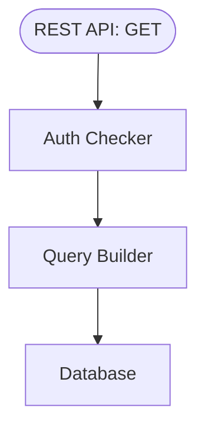

# MGP-Messages

- [MGP-Messages](#mgp-messages)
  - [Roadmap](#roadmap)
  - [Building](#building)
    - [Dependencies](#dependencies)
  - [Internal Architecture](#internal-architecture)
    - [Code Layout](#code-layout)
  - [API](#api)
    - [Headers](#headers)
    - [Query Parameters](#query-parameters)
    - [Post Object](#post-object)
  - [Media Objects](#media-objects)
    - [`GET /posts/{ROOT POST UUID}`](#get-postsroot-post-uuid)
    - [`GET /search/all`](#get-searchall)
    - [`GET /user/{USER UUID in URLSAFE BASE64}/posts`](#get-useruser-uuid-in-urlsafe-base64posts)
    - [`GET /user/{USER UUID in URLSAFE BASE64}/follows`](#get-useruser-uuid-in-urlsafe-base64follows)
    - [Responses](#responses)

## Roadmap

- [ ] Paging Support
- [ ] Thread Assembly
- [ ] Individual Post Retrieval
- [X] DB Schema

## Building

`cargo build` will build the binary executable with all its dependencies statically linked.

### Dependencies

This service expects a database with the correct schema already in place. Use the diesel-cli tool to do this.

## Internal Architecture



The Messages service is strictly stateless and read-only. It will *not* produce a database write under any circumstances
(although it may log events in a different logging DB).

- **It is the responsibility of the API Gateway** to resolve an API token to a user ID for authentication.
- **It is the responsibility of the Account Manager** to associate images with their metadata (posts, user owner, etc) as well as to inform the Messages Service which posts a user cannot see (for example posts from private users and users blocking them).

### Code Layout

- The HTTP API can be found in `src/main.rs`.
- Transcoding functionality for both videos and images are in `src/convert.rs`.
- Name normalization and resolution is in `fs.rs`.

## API

### Headers

All API headers must include the `Bearer` field which has as its value the UUID of the user requesting the data.
Note that this is different from the `Bearer` field required by the public-facing API gateway, which requires an
access token which may expire. It is up to the API gateway to ensure the access token is valid and *replace* it with
the resolved name for the Messages service.

### Query Parameters

All endpoints which query posts accept certain parameters which allow clients to refine what data they will receive.
These parameters are specified via standard URL params: `?depth=[int]&limit=[int]&sort=[best|new]&fields=comma,separated,list,of,fields&expansions=comma,separated,list,of,expansions`,
All url parameters are optional, although some queries will return an empty (but OK) response when none are set.

- **depth=integer**: Specifies how the lookup of child posts should be performed. Depth of zero fetches only the root post. A depth of 1 fetches the root post and all comments which are its direct children. A depth of 2 fetches all comments which are its grandchildren, and so on. A negative depth will fetch the post and its entire comment tree.
- **limit=integer**: Specifies the total number of comments to be returned in the response if `comments` is expanded.
- **before=ISO 8601 DateTime String** and **after=ISO 8601 DateTime String**: Return only posts within the given time bounds (inclusive).
  - This can be used in conjunction with `limit` to produce pagination in chronological reply sorting mode.
- **score=INTEGER? [> | < | <= | >= ] INTEGER**: Return comments with like counts within the given range.
  - The left-bound may be omitted for an unbounded query, for example all posts with score `100>=`
  - This can be used in conjunction with `limit` to produce pagination in scored reply sorting mode. Beware that adding and removing likes on posts is not atomic, and the client should perform additional checks to ensure they are not duplicating posts as the contents and order of the score-sorted list of children may change between requests.
- **sort=[best|new]**: Specifies how the returned list of comments should be sorted. `best` will sort based on like count, and `new` sorts based on post time.
- **tags=comma,separated,list,of,hashtags**: Return only posts which contain ALL the given tags (Logical AND).

The **fields=commaseplist** field is a comma-separated list describing which fields of the lookup the client is interested in.
Here is the list of fields that can be queried for:

- **reblogs**: Whether or not to include posts that are reblogs of other posts.
- **body**: The text content of the post.
- **media**: An array of json-serialized [media objects](#media-objects).
- **author**: The UUID of the user who created the post.
- **published**: ISO 8601 DateTime String referencing the time the post was created.
- **likes**: A nonnegative integer describing how many users have liked the post.
- **reblogs**: A nonnegative integer describing how many users have reblogged the post.
- **comments**: A nonnegative integer counting the number of posts which are children of the requested post.
- **mentions**: A set of UUIDs referring to users mentioned in the post (@user),
- **tags**: A set of strings representing the hashtags used in the post (#tag),
- **parent**: An optional field describing the post this post is a child of.
  - If the post is a reblog, the response will be `{"type": "reblog", "id": "UUID of the Parent"}`
  - If the post is a comment, the response will be `{"type": "comment", "id": "UUID of the Parent"}`
- **flags**: A JSON object representing additional metadata.

The **expansions=base64** field specifies which response fields should be expanded with query results from other domains. This value is a url-safe base64-encoded json-serialized set of field names. Any field which may be queried separately (listed below) can be expanded by specifying their dot-separated path.
Expansions can only ever be a single attribute deep. For example, it is possible to expand the list of likes to include user ids with `expand=likes.users`, but it is not possible to resolve those users' profile pictures in the same request.

For example, to get the profile picture of the post author, the client would specify `expansions=author.profile_image`.

The response field `author` would then change from

```json
{
    "id": "author uuid",
}
```

to

```json
"author": {
    "id": "author uuid",
    "profile_image": {
        "type": "local", // Type may be different based on where the file is stored i.e. on a remote server
        "id": "[GALLERY FILE ID]"
    }
}
```

### Post Object

Un-expanded, a complete post object has the following fields:

```json
{
    "id": "72c5da28-1319-4831-9241-6af098d40f4c",
    "author": {
        "id": "9933311d-9398-4dcb-8b54-ce118bfdb99c",
    },
    "body": "Hello, World!",
    "media": [
        {
            "type": "local",
            "id": "abc123def456",
        },
        {
            "type": "local",
            "id": "foobar1234",
        }
    ],
    "published": "20230710T221006Z",
    "likes": {
        "count": 3
    },
    "reblogs": {
        "count": 1
    },
    "mentions": [
        {
            "id": "13b1d1ca-3057-4d19-91f6-58fb3ff2ad4c"
        },
        {
            "id": "cea1e735-5928-4763-a20d-958dbbb004fb"
        }
    ],
    "tags": ["thisIsATestPost", "thisIsATag"],
    "comments": {
        "count": 8
    },
    "flags": {} // May have Any contents
}
```

Expansions may *add fields* to existing objects, but will **never change field types**.

For example, `"likes"` will *always* be a JSON object. By default it will only have the `"count"` field,
but expanding it with `likes.users` will expand it to be:

```json
{
    // --snip for brevity--
    "likes": {
        "count": 3,
        "users": [
            "13b1d1ca-3057-4d19-91f6-58fb3ff2ad4c",
            "cea1e735-5928-4763-a20d-958dbbb004fb",
            "9933311d-9398-4dcb-8b54-ce118bfdb99c",
        ]
    }
}
```

## Media Objects

A media object is a JSON object describing where a resource is stored.
Regardless of the resource's origin, clients should treat it as an external resource for the purposes of security.

```json
{
    "kind": "local",
    "id": "localResourceIdForMediaCaddy",
}
```

```json
{
    "kind": "url",
    "url": "https://cdn.example.com/resource/foobar.png",
}
```

```json
{
    "kind": "svg",
    "svg": "data:image/svg+xml;utf8,<svg xmlns='http://www.w3.org/2000/svg' width='10' height='10'><linearGradient id='gradient'><stop offset='10%' stop-color='%23F00'/><stop offset='90%' stop-color='%23fcc'/> </linearGradient><rect fill='url(%23gradient)' x='0' y='0' width='100%' height='100%'/></svg>",
}
```

```json
{
    "kind": "base64",
    "data": "data:image/png;base64,iVBORw0KGgoAAAANSUhEUgAAADIA..." // use a CSS-style data URI
}
```

### `GET /posts/{ROOT POST UUID}`

Retrieve a sequence of posts based on a JSON request. The UUID in the url must be serialized into URL-safe base64.

If `comments` is expanded (see above), the `comments` field becomes a JSON array of the above post object, sorted
according to the requested sorting mode. The total number of comments returned will be limited by `limit` and respects sorting filter fields.

### `GET /search/all`

Returns a JSON array of the posts which satisfy the conditions in the query parameters.
To get a list of `latest` posts, sort by `new`. To get the top posts of a certain time period, sort by `best`.

### `GET /user/{USER UUID in URLSAFE BASE64}/posts`

Returns a json array of posts authored by the given user.

### `GET /user/{USER UUID in URLSAFE BASE64}/follows`

Functions like [`GET /search/all`](#get-searchall) but the search is restricted only
to posts authored by users the given user follows.

### Responses

A successful query will be sent a `200 OK` and the body of the response as stated
above, or no body if none is defined in the above spec.

A query to a post ID that is valid but not present in the store will get a
`404 Not Found` response.

A query to a post ID that is invalid or a query with invalid parameters will get a `400 Bad Request` response.

A query to any endpoint not in the established API will get a `405 Method Not Allowed` response.

If there is some internal error unrelated to the request, for example some FFI or DNS error, the server
will respond with `500 Internal Server Error` and log an urgent message with the Service Health Monitor.
